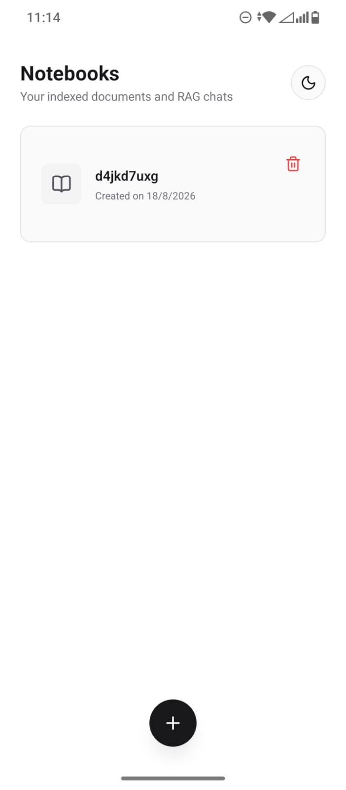
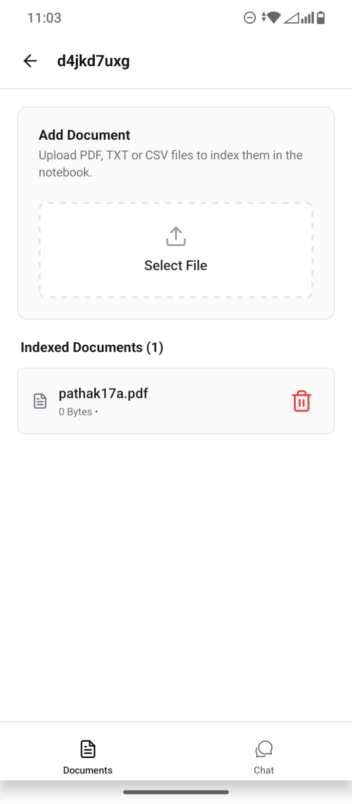
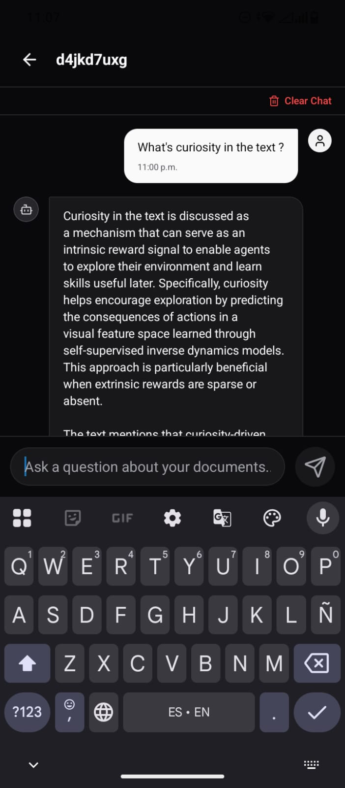
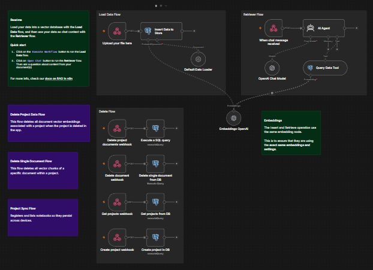

# Local Notebook (n8n + pgvector + Expo)

This project is a cross-platform mobile application (iOS, Android, and Web) built with **Expo** and **React Native** that allows you to chat with your own documents (PDF, text, etc.) using **100% private Artificial Intelligence**. The entire infrastructure (vector database, automation, and LLM models) runs locally on your own machine.

---

## Screenshots (Introduction)

To guarantee total confidentiality, the processing flow is executed without sending any data outside your local infrastructure:

| Pantalla de Inicio | Listado de Documentos | Chat con IA Privado |
| :-------------------------------------------: | :----------------------------------------------------: | :-----------------------------------------: |
|  |  |  |

### Automated Workflow in n8n

The RAG logic for file ingestion, embeddings, vector storage, and conversational chat agent is fully orchestrated in a visual workflow within **n8n**:



---

## Local Architecture

- **Frontend:** Mobile application built in **React Native / Expo** with Tailwind CSS (NativeWind).
- **Database:** **PostgreSQL with pgvector** for vector storage and project metadata.
- **Orchestrator (Backend):** **n8n** managing the Artificial Intelligence agents' logic (integrated LangChain).
- **LLM & Embeddings Engine:** **Ollama** running locally with the `qwen2.5:7b` and `nomic-embed-text` models.

---

## Installation and Usage Guide

### Prerequisites

- Have **Docker** and **Docker Compose** installed.
- Have **Node.js** (version 18 or higher) installed.

---

### Step 1: Clone the Repository

Open a terminal and run the following command:

```bash
git clone https://github.com/Dasango/placeholder.git
cd placeholder

```

---

### Step 2: Start the Backend Infrastructure (Docker)

Spin up the local containers (PostgreSQL, Ollama, n8n):

```bash
docker compose up -d

```

This command will automatically download and configure:

1. The PostgreSQL vector database on port `5432`.
2. The Ollama container and will start downloading the `qwen2.5:7b` and `nomic-embed-text` models in the background.
3. The local n8n server exposed on port `5678`.

---

### Step 3: Configure and Start the Mobile App (Expo)

1. Navigate to the application folder:

```bash
cd app

```

2. Install the necessary dependencies:

```bash
npm install

```

3. Start the Expo development server:

```bash
npx expo start

```

Once the QR code appears in the console:

- **Physical Device:** Scan the QR code from the **Expo Go** app (available on the Google Play Store and Apple App Store). Make sure your phone and PC are connected to the same Wi-Fi network.
- **Emulators:** Press `a` to open in an Android emulator or `i` for an iOS simulator.
- **Web:** Press `w` to test the web version in your browser.

---

## Backend Endpoints Documentation (n8n Webhooks)

The backend exposed in n8n provides the following communication endpoints that the React Native application uses:

### 1. Get Projects and Documents

Returns all projects and the list of documents stored in the vector database.

- **HTTP Method:** `GET`
- **URL:** `http://localhost:5678/webhook/get-projects`
- **Response Example:**

```json
[
  {
    "id": "project_report_12345",
    "name": "Sales Report",
    "documents": ["q2_report.pdf", "annual_sales.pdf"]
  }
]
```

### 2. Register Project

Registers a new project in the database for persistence across multiple devices.

- **HTTP Method:** `POST`
- **URL:** `http://localhost:5678/webhook/create-project`
- **Request Body (JSON):**

```json
{
  "projectId": "unique-project-id",
  "name": "My Project Name"
}
```

### 3. Ingest and Upload a Document

Uploads a file into the RAG ingestion system to process its text, generate vector embeddings, and save it.

- **HTTP Method:** `POST`
- **URL:** `http://localhost:5678/webhook/upload-pdf`
- **Content-Type:** `multipart/form-data`
- **Body Parameters:**
- `data`: Binary file (e.g., PDF file).
- `projectId`: Associated project ID.

### 4. Conversational Chat (Ask the RAG Agent)

Sends questions to the Intelligent Agent. It will search for semantic similarities in the vector database and answer solely based on the information in your documents.

- **HTTP Method:** `POST`
- **URL:** `http://localhost:5678/webhook/chat`
- **Request Body (JSON):**

```json
{
  "message": "What are the conclusions of the document?",
  "projectId": "unique-project-id"
}
```

### 5. Delete a Project

Deletes a project and all its associated vector representations from the database.

- **HTTP Method:** `POST`
- **URL:** `http://localhost:5678/webhook/delete-project`
- **Request Body (JSON):**

```json
{
  "projectId": "unique-project-id"
}
```

### 6. Delete a Document

Deletes the vector chunks corresponding to a specific document within a project.

- **HTTP Method:** `POST`
- **URL:** `http://localhost:5678/webhook/delete-document`
- **Request Body (JSON):**

```json
{
  "projectId": "unique-project-id",
  "documentName": "annual_sales.pdf"
}
```
